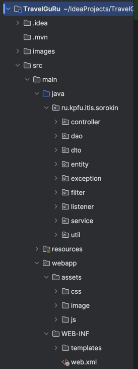
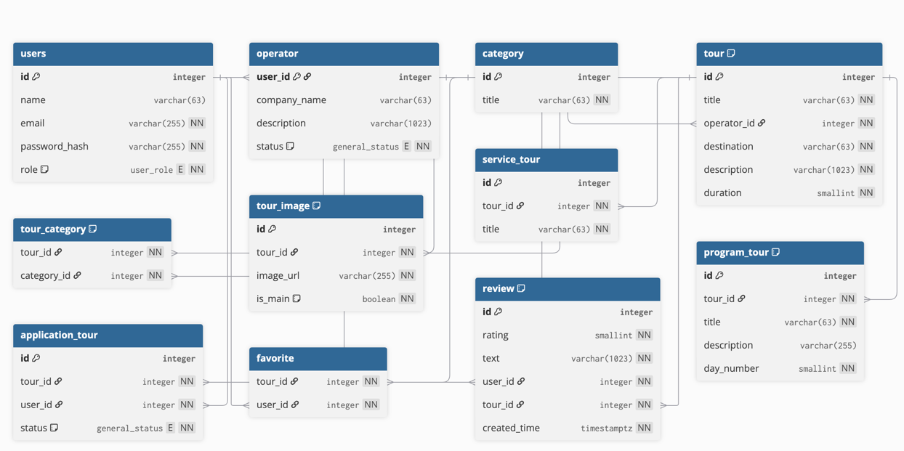
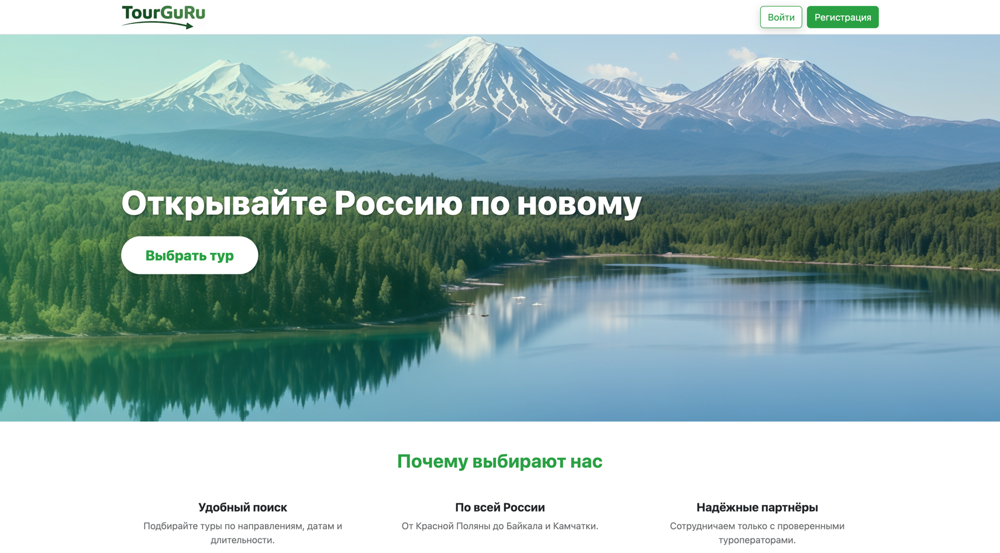
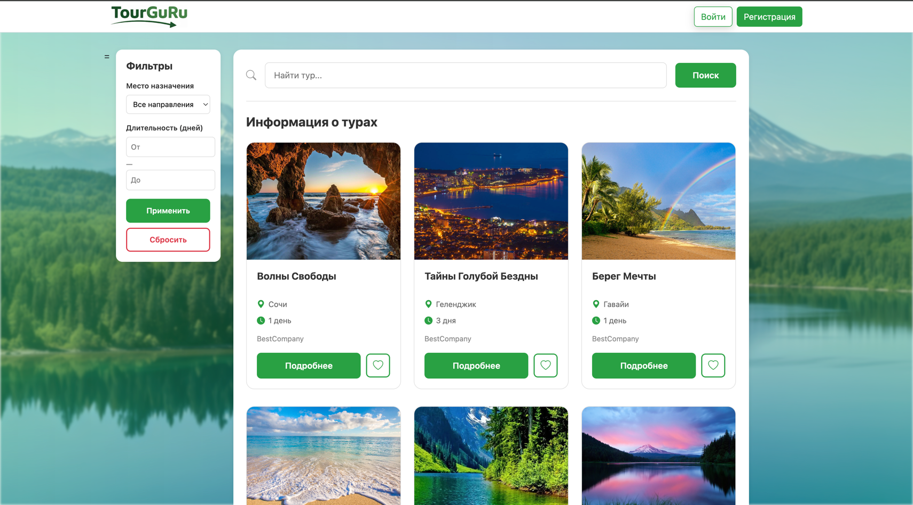
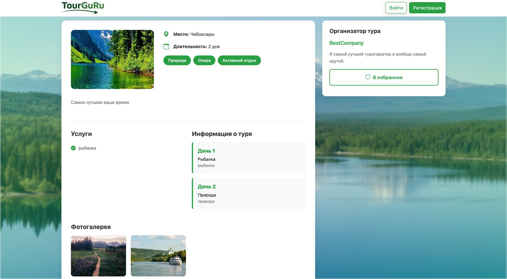
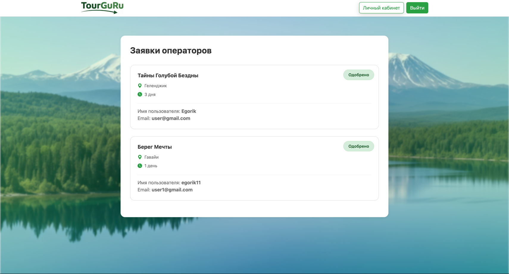
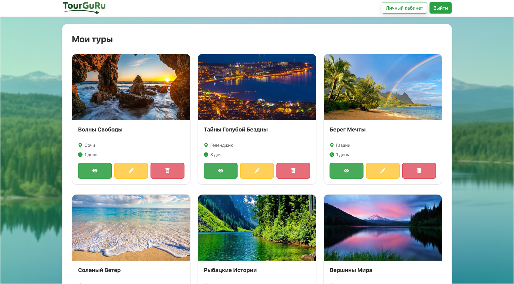
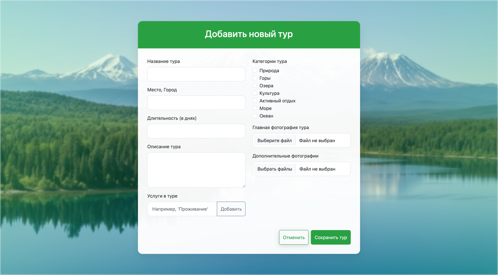

# 🏔️ TravelGuRu

> Платформа для размещения и поиска туров по России. Туроператоры публикуют туры, пользователи оставляют заявки и общаются с операторами.


---

## 📌 О проекте

**TravelGuRu** — веб-платформа для размещения туров по России. Туроператоры регистрируются, добавляют свои туры с детальной информацией (программа дня, услуги, фото), а пользователи могут искать подходящие туры, оставлять заявки и писать в личные сообщения оператору.

### Решаемая проблема

Пользователям сложно самостоятельно искать качественные туры по России, а туроператорам нужна площадка для публикации своих предложений. TravelGuRu собирает все туры в одном месте с удобной навигацией и фильтрацией.

---

## ✨ Основные возможности

### Для пользователей:
- 🔍 Просмотр каталога туров (даже без регистрации)
- 📋 Подробная информация о туре: программа по дням, услуги, фотографии
- 💬 Оставление заявки на понравившийся тур
- 📨 Комментарии под турами
- 💬 Система отзывов на туры *(в разработке)*
- ⭐ Избранное *(в разработке)*

### Для туроператоров:
- ➕ Добавление новых туров с полным описанием
- ✏️ Редактирование и удаление своих туров
- 📩 Просмотр заявок от пользователей на свои туры

### Для администратора:
- ✅ Аппрув регистрации туроператоров

---

## 🛠️ Технологии

| Технология | Назначение |
|-----------|------------|
| **Java 17** | Серверная логика |
| **Java Servlets** | Обработка HTTP-запросов (без фреймворков) |
| **FreeMarker (FTL)** | Шаблонизатор для генерации HTML |
| **PostgreSQL** | База данных |
| **JDBC + PreparedStatement** | Работа с БД (без ORM) |
| **HTML5 / CSS3 / JavaScript** | Фронтенд (ванильный JS, AJAX) |
| **Maven** | Сборка проекта |
| **Tomcat 10** | Сервер приложений |

### Архитектурные принципы:
- **MVC (Model-View-Controller)** — четкое разделение слоев
- **SOLID** — принципы проектирования (разделение ответственности, инверсия зависимостей)
- **WebFilter** для аутентификации и авторизации
- **WebListener** для инициализации сервисов

---

## 🗂️ Архитектура проекта

```
src/main/java/ru.kpfu.itis.sorokin/
├── controller/       # Сервлеты (обработчики HTTP-запросов)
├── dao/              # Data Access Objects (работа с БД)
├── dto/              # Data Transfer Objects (передача данных между слоями)
├── entity/           # Сущности БД (User, Tour, Review и т.д.)
├── exception/        # Пользовательские исключения
├── filter/           # Фильтры (аутентификация, кодировка)
├── listener/         # Слушатели (инициализация сервисов)
├── service/          # Бизнес-логика
└── util/             # Вспомогательные классы (хеширование паролей, валидация)
```



---

## 🗄️ База данных

Проект использует PostgreSQL с 10 таблицами:

**Основные таблицы:**
- `users` — пользователи (USER, OPERATOR, ADMIN)
- `operator` — дополнительная информация о туроператорах
- `tour` — туры
- `tour_category` — связь туров с категориями (M2M)
- `application_tour` — заявки пользователей на туры
- `review` — отзывы на туры
- `favorite` — избранные туры пользователя
- `tour_image` — фотографии туров
- `service_tour` — услуги, входящие в тур
- `program_tour` — программа тура по дням

**ER-диаграмма:**


---

## 🚀 Запуск проекта

### Требования:
- **Java 17+**
- **Maven 3.8+**
- **PostgreSQL 15+**
- **Apache Tomcat 10+**

### Шаги установки:

1. **Клонируй репозиторий:**
   ```bash
   git clone https://github.com/[твой-username]/TravelGuRu.git
   cd TravelGuRu
   ```

2. **Создай базу данных:**
   ```sql
   CREATE DATABASE travelguru;
   ```

3. **Выполни SQL-скрипт для создания таблиц:**
   ```bash
   psql -U postgres -d travelguru -f src/main/resources/schema.sql
   ```
   <!-- [УКАЖИ ПУТЬ К SQL-СКРИПТУ] -->

4. **Настрой подключение к БД:**
   Отредактируй файл `src/main/resources/db.properties`:
   ```properties
   db.url=jdbc:postgresql://localhost:5432/travelguru
   db.username=postgres
   db.password=твой_пароль
   ```

5. **Собери проект:**
   ```bash
   mvn clean package
   ```

6. **Разверни WAR-файл на Tomcat:**
   - Скопируй `target/TravelGuRu.war` в папку `webapps` Tomcat
   - Запусти Tomcat:
     ```bash
     ./bin/catalina.sh run
     ```

7. **Открой в браузере:**
   ```
   http://localhost:8080/TravelGuRu
   ```

---

## 📸 Скриншоты

### Главная страница

> Приветственный экран с навигацией и кнопками входа/регистрации

### Каталог туров

> Список всех туров с категориями, доступен без авторизации

### Детальная информация о туре

> Полное описание тура: программа по дням, услуги, фотографии, отзывы

### Профиль туроператора



> Управление турами: добавление, редактирование, просмотр заявок

### Комментарии

> Комментарии под туром

---

## 🎯 Реализованный функционал (MVP)

- ✅ Регистрация и авторизация (USER, OPERATOR, ADMIN)
- ✅ Главная страница с навигацией
- ✅ Каталог туров (доступен без авторизации)
- ✅ Детальная страница тура
- ✅ Личный кабинет (редактирование профиля)
- ✅ Добавление/редактирование/удаление туров (для операторов)
- ✅ Оставление заявки на тур (для пользователей)
- ✅ Просмотр заявок (для операторов)
- ✅ Комментарии под карточками туров (пользователь ↔ оператор)
- ✅ Система отзывов (AJAX)

---

## 👨‍💻 Автор

**[Egor]**  
📧 Email: [sorokine329@gmail.com]  
💼 GitHub: [EgorXx](https://github.com/EgorXx)

---

<div align="center">
  Сделано с ❤️ для путешественников по России
</div>
